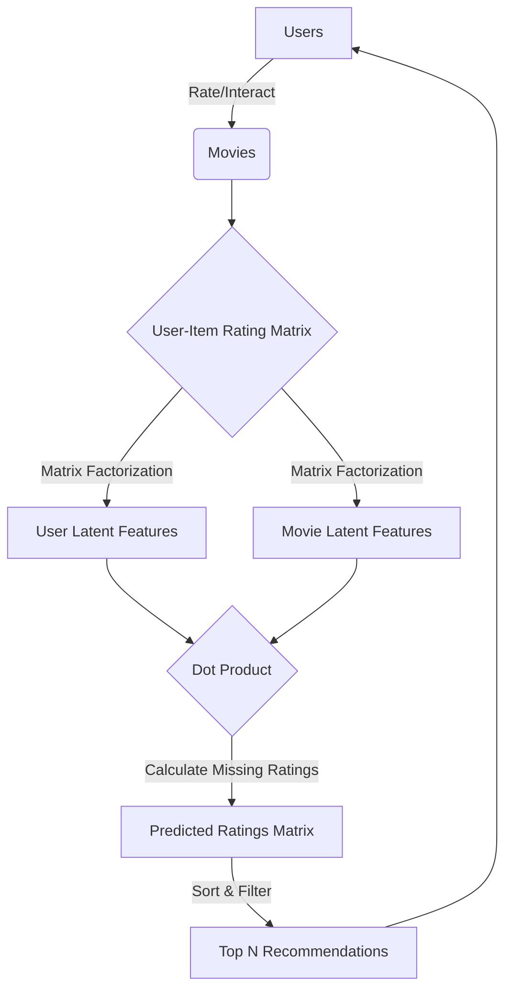

# Movie-Recommender-System

**Built by : Dhruv Tuli**
A Web Base user-item Movie Recommendation Engine using Collaborative Filtering By matrix factorizations algorithm and
The recommendation based on the underlying idea that is if two persons both liked certian common movies,then the movies that one person has liked that the other person has not yet watched can be recommended to him.   
## System Architecture

The recommendation system utilizes **Collaborative Filtering** via **Matrix Factorization**. It models user-movie interactions by mapping both users and movies to a joint latent factor space, enabling accurate predictions of unseen movies.




### Technologies Used

#### Web Technologies
Html , Css , JavaScript , Bootstrap , Django

#### Machine Learning Library In Python3
Numpy , Pandas , Scipy

#### Database
SQLite

##### Requirements
```
python 3.6

pip3

virtualenv
```
##### Setup to run

Extract zip file in your computer

Open terminal/cmd promt

Goto that Path

Example

```
cd ~/Destop/Movie-Recommender-System
```
Create a new virtual environment on that directory

```
virtualenv .
```

Activate Your Virtual Environment

for Linux
```
source bin/activate
```
for Windows
```
cd Scripts
then
activate
```
To install Dependencies

```
pip install -r requirements.txt
```

### Creating Local Server

Goto src directory, example

```
cd ../Movie-Recommender-System/src
```
To run
```
python manage.py runserver
```
Now open your browser and go to this address
```
http://127.0.0.1:8000
```
Thank you for visiting my repository.
